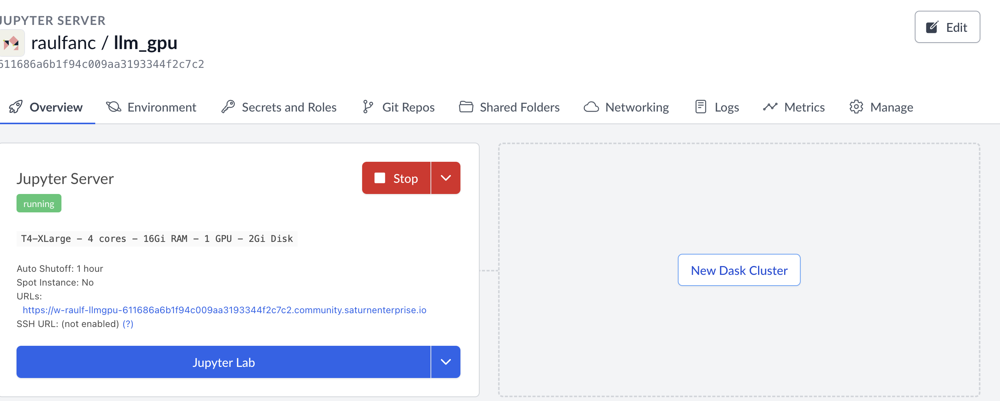
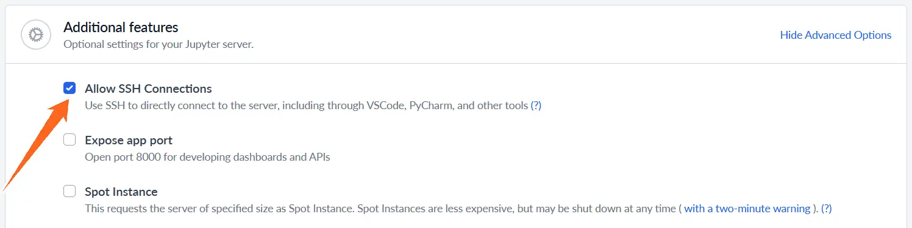
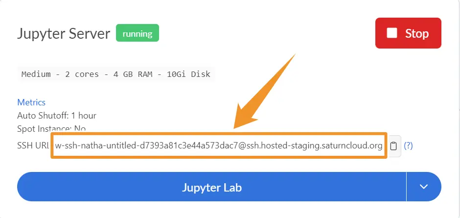

**attention: when running multiple vm with VS code, remote-ssh extension has problem to locate the correct ssh key saved and created on the vm machine. for instance, my development is based on codespace's vm, and ssh keys are created within it. Remote-SSH is not able to locate this ssh config file during connection to the saturn cloud vm.**

### saturn cloud: 
1. link: https://app.community.saturnenterprise.io/auth/login?next=%2Fdash%2Fo%2Fcommunity%2Fresources
2. Huggingface: https://huggingface.co/ (need access token)
3. python libs needed for the project, put into saturn cloud ui.
```terminal
pip install -U transformers accelerate bitsandbytes sentencepiece
```
4. adding github `local` -> `ssh`, and paste to `saturn` cloud ui
5. using GPU: `saturn cloud` -> `resources` -> `create` -> `GPU`.




### connect to an external IDE (VS CODE)
```terminal 
cd ~/.ssh
```

```terminal
ssh-keygen -t rsa -b 4096 -C "your_email@example.com" -f ~/.ssh/id_rsa_saturn
```

```terminal
eval "$(ssh-agent -s)"
ssh-add ~/.ssh/id_rsa_saturn
```

```terminal
cat ~/.ssh/id_rsa_saturn.pub
```
**copy the output and paste it to saturn cloud UI > `New SSH key`**

```terminal
touch config
```

```terminal
nano config
```

```terminal
Host saturn-cloud
    HostName <saturn-cloud-ip>
    User <your-saturn-cloud-username>
    IdentityFile ~/.ssh/id_rsa_saturn
    IdentitiesOnly yes
```

where to find HostName and User:
- when creating resources, need to enable `SSH`

- left side of `@` is User, right side is HostName


